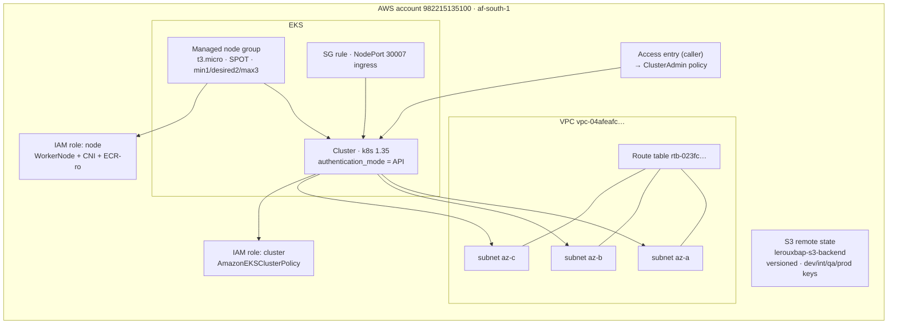
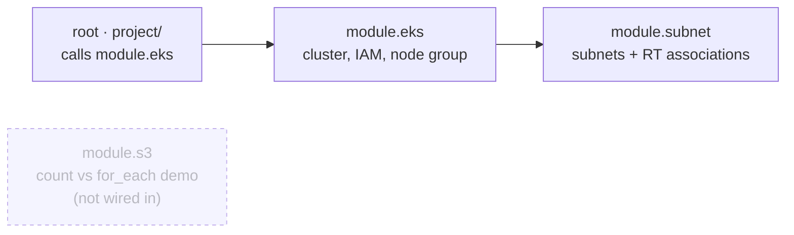
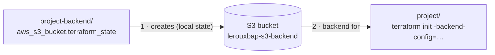
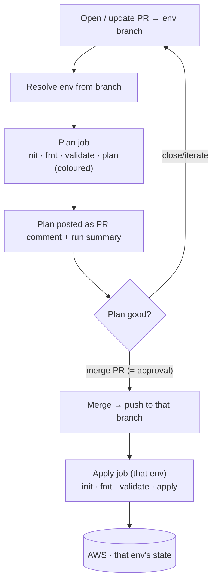

# capitec-terraform-training

Terraform training project that stands up an **Amazon EKS** cluster (plus its
network and IAM) in `af-south-1`, with remote state in S3 and a gated
GitHub Actions pipeline.

- **`project/`** — the deployable root module (EKS + subnet + s3 modules).
- **`project-backend/`** — one-off bootstrap of the S3 state bucket.

---

## Architecture



### Subnets per environment

All environments deploy into the **same VPC**, so each gets its own non-overlapping
`/24` trio (`brandon_le_roux`'s allocation, extended per environment in the root
`env_subnets` map in `participants.tf`). The `eks` module just receives `cidr_blocks`.

| Environment | Subnets (one per AZ) |
|-------------|----------------------|
| `dev` | `10.0.6.0/24`, `10.0.7.0/24`, `10.0.8.0/24` *(brandon's original block)* |
| `int` | `10.0.105.0/24`, `10.0.106.0/24`, `10.0.107.0/24` |
| `qa` | `10.0.108.0/24`, `10.0.109.0/24`, `10.0.110.0/24` |
| `prod` | `10.0.111.0/24`, `10.0.112.0/24`, `10.0.113.0/24` |

The `participants` table in `participants.tf` (34 trainees, 3 consecutive `/24`s
each, generated from a base octet) remains as the class reference allocation;
`dev` reuses `brandon_le_roux`'s entry from it.

---

## Module dependencies



| Module | Purpose | Instantiated? |
|--------|---------|---------------|
| `project/` (root) | Wires everything together; owns the S3 backend + provider `default_tags` | — |
| `modules/eks` | EKS cluster, IAM roles (via `for_each`), access entry, node group, NodePort SG rule | ✅ by root |
| `modules/subnet` | One subnet per AZ + route-table associations (via `for_each`) | ✅ by `eks` |
| `modules/s3` | Standalone `count`-vs-`for_each` teaching demo | ❌ (reference only) |

---

## Remote state

The state bucket is a **chicken-and-egg bootstrap**: `project-backend/` creates
the S3 bucket first (with local state), and `project/` then uses it as its
remote backend.



- **Backend:** S3 bucket `lerouxbap-s3-backend` — **versioned**, AES256-encrypted,
  public access fully blocked, with native state locking (`use_lockfile`). These
  are enforced by `project-backend/` so the bucket is bootstrapped correctly for
  every environment.
- **Per-environment keys:** `values/<env>/<env>.tfbackend` → `dev/`, `int/`, `qa/`,
  `prod/…terraform.tfstate` — one state file per environment (created on first apply).
- Initialise for an environment with:

  ```bash
  cd project
  terraform init -backend-config="values/dev/dev.tfbackend"
  terraform plan  -var-file="values/dev/dev.tfvars"
  ```

---

## Branch model & protection

Current branches — `main` (default) plus one per environment, all seeded from `main`:


All of the above are protected by the **`protect-environments`** ruleset:

| Rule | Effect |
|------|--------|
| Require pull request | No direct pushes; changes land via PR |
| Required approvals = **0** | Solo-friendly (GitHub blocks self-approval, so a PR + green check is the gate) |
| Required status check | **`Plan`** must pass before merge |
| Block force-push / deletion | History and branches are protected |

Feature branches (anything not listed above) are unprotected, so you branch,
push, and open a PR freely.

---

## CI/CD pipeline

`.github/workflows/terraform.yml` — **plan on the PR, apply on merge**, with the
target **environment derived from the branch** (`dev`/`int`/`qa`/`prod`; `main` → dev).



| Trigger | Runs | Environment |
|---------|------|-------------|
| `pull_request` → env branch | **Plan** only (comment + summary; apply skipped) | target branch |
| `push` after a merge | **Apply** only (`-auto-approve`, re-plans so never stale) | pushed branch |
| Manual `workflow_dispatch` | Plan + Apply | selected branch |
| `terraform-destroy.yml` (manual) | **Destroy** (type `destroy` to confirm) | chosen env |

Each branch uses its own `values/<env>/<env>.tfbackend` (state) and
`<env>.tfvars` (variables); the apply runs under the matching **GitHub
Environment** (`dev`/`int`/`qa`/`prod`) for per-env deployment history.
`fmt` + `validate` run immediately before every plan/apply. Merging a PR **is**
the approval. AWS auth uses the repo secrets `AWS_ACCESS_KEY_ID` /
`AWS_SECRET_ACCESS_KEY`.

---

## Key variables (`project/variables.tf`)

| Variable | Default | Purpose |
|----------|---------|---------|
| `region` | `af-south-1` | AWS region to deploy into |
| `environment` | `dev` | Selects the env's subnet block + names resources |
| `capacity_type` | `SPOT` | `ON_DEMAND` or `SPOT` (validated) |
| `surname` / `initials` | `leroux` / `bap` | Compose the `lerouxbap` resource prefix |
| `vpc_id` / `rt_id` | pre-set | Existing VPC / route table to attach to |
