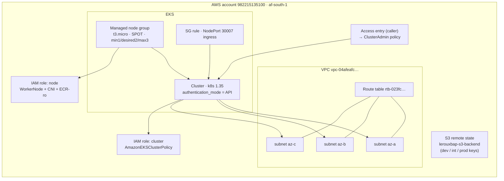
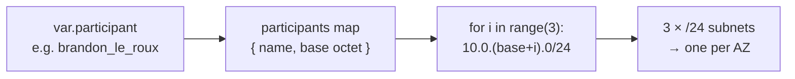
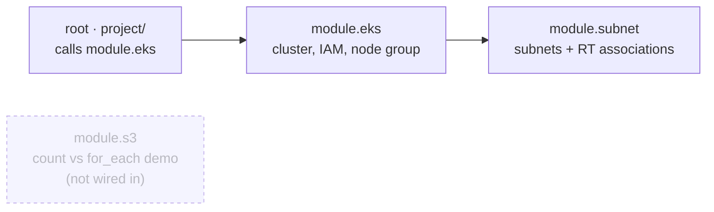
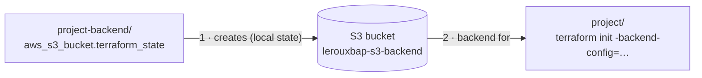
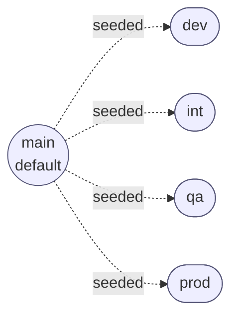
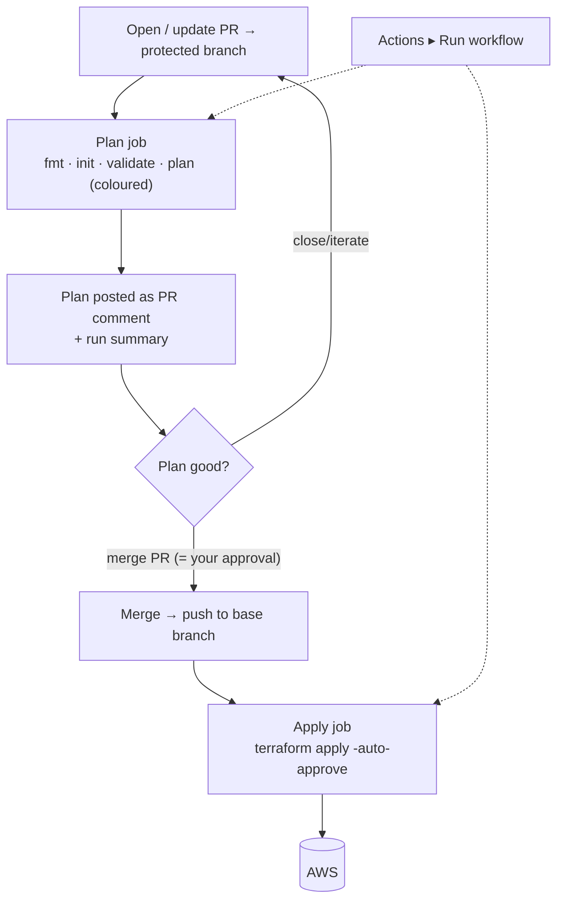

# capitec-terraform-training

Terraform training project that stands up an **Amazon EKS** cluster (plus its
network and IAM) in `af-south-1`, with remote state in S3 and a gated
GitHub Actions pipeline.

- **`project/`** — the deployable root module (EKS + subnet + s3 modules).
- **`project-backend/`** — one-off bootstrap of the S3 state bucket.

---

## Architecture



Subnet CIDRs are chosen per **trainee** via `var.participant` (a key into the
allocation table in `modules/eks/eks.locals.tf`). Each trainee gets three
consecutive `/24`s, generated from a base octet rather than hand-listed:



| participant | base | subnets |
|-------------|------|---------|
| `amen_moipushi` | 0 | `10.0.0/1/2.0/24` |
| `brandon_le_roux` *(default)* | 6 | `10.0.6/7/8.0/24` |
| `nathan_mills` | 60 | `10.0.60/61/62.0/24` |
| … 34 trainees total | | |

---

## Module dependencies



| Module | Purpose | Instantiated? |
|--------|---------|---------------|
| `project/` (root) | Wires everything together; owns the S3 backend + provider `default_tags` | — |
| `modules/eks` | EKS cluster, IAM roles (via `for_each`), access entry, node group, NodePort SG rule | ✅ by root |
| `modules/subnet` | One subnet per AZ + route-table associations (via `for_each`) | ✅ by `eks` |
| `modules/s3` | Standalone `count`-vs-`for_each` teaching demo | ❌ (reference only) |

---

## Remote state

The state bucket is a **chicken-and-egg bootstrap**: `project-backend/` creates
the S3 bucket first (with local state), and `project/` then uses it as its
remote backend.



- **Backend:** S3 bucket `lerouxbap-s3-backend`, native lockfile (`use_lockfile`).
- **Per-environment keys:** `values/<env>/<env>.tfbackend` → `dev/`, `int/`, `prod/…terraform.tfstate`.
- Initialise for an environment with:

  ```bash
  cd project
  terraform init -backend-config="values/dev/dev.tfbackend"
  terraform plan  -var-file="values/dev/dev.tfvars"
  ```

---

## Branch model & protection

Current branches — `main` (default) plus one per environment, all seeded from `main`:



All of the above are protected by the **`protect-environments`** ruleset:

| Rule | Effect |
|------|--------|
| Require pull request | No direct pushes; changes land via PR |
| Required approvals = **0** | Solo-friendly (GitHub blocks self-approval, so a PR + green check is the gate) |
| Required status check | **`Plan`** must pass before merge |
| Block force-push / deletion | History and branches are protected |

Feature branches (anything not listed above) are unprotected, so you branch,
push, and open a PR freely.

---

## CI/CD pipeline

`.github/workflows/terraform.yml` — **plan on the PR, apply on merge.**



| Trigger | Runs |
|---------|------|
| `pull_request` → `main`/`dev`/`int`/`qa`/`prod` | **Plan** only (comment + summary; apply skipped) |
| `push` after a merge | **Apply** only (`-auto-approve`, re-plans so never stale) |
| Manual `workflow_dispatch` | Both, gated only by branch selection |

Merging a PR **is** the approval — there is no separate deploy-approval gate.
AWS auth uses the repo secrets `AWS_ACCESS_KEY_ID` / `AWS_SECRET_ACCESS_KEY`.

> **Note:** CI currently always inits with `values/dev/dev.tfbackend`, so every
> pipeline run targets the **dev** state regardless of branch. Per-environment
> backends exist for manual use; wiring the CI backend to the target branch is a
> future step.

---

## Key variables (`project/variable.tf`)

| Variable | Default | Purpose |
|----------|---------|---------|
| `participant` | `brandon_le_roux` | Selects the trainee's `/24` subnet block |
| `capacity_type` | `SPOT` | `ON_DEMAND` or `SPOT` (validated) |
| `environment` | `dev` | Name suffix on resources |
| `surname` / `initials` | `leroux` / `bap` | Compose the `lerouxbap` resource prefix |
| `vpc_id` / `rt_id` | pre-set | Existing VPC / route table to attach to |
